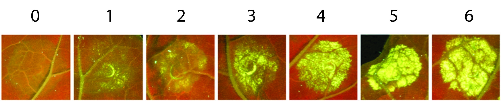
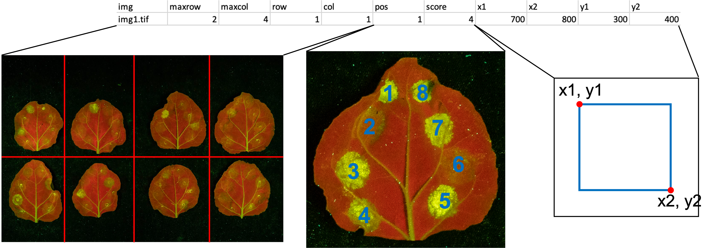

# CDAScorer

<!-- badges: start -->
[](https://pypi.org/project/cdascorer/)
[](https://github.com/joshuandwilliams/CDAScorer/actions/workflows/ci.yml)
[](https://codecov.io/gh/joshuandwilliams/CDAScorer)
[](https://lifecycle.r-lib.org/articles/stages.html#experimental)

[](LICENSE.txt)
<!-- badges: end -->

A Python/Tkinter tool for annotating cell death areas (CDAs) from agroinfiltration leaf images. Designed for plant science researchers who need to systematically score lesion severity across large image datasets.

## What it does

CDAScorer provides a GUI workflow for recording bounding box coordinates and severity scores (0–6) for individual CDAs on photographed leaves arranged in a grid pattern. It ships three command-line tools:

| Command | Purpose |
|---------|---------|
| `cdascorer` | Score new images — draw a bounding box around each CDA and assign a severity score. |
| `cdascorer-view` | Review previously scored annotations overlaid on their source image. |
| `cdascorer-rescore` | Re-present a random sample of a scorer's existing CDAs to measure intra-scorer consistency. |

## Installation

```bash
pip install cdascorer
```

Or install from source:

```bash
git clone https://github.com/joshuandwilliams/CDAScorer.git
cd CDAScorer
pip install .
```

Requires Python 3.9 or later. Depends on `pandas` and `Pillow`.

## Scoring new images

```bash
cdascorer --source_folder /path/to/images/ --file output.csv
```

This opens a GUI that walks you through each image:

1. **Grid entry** — specify the number of leaf rows and columns in the image, and the number of CDAs per leaf, then press **Submit**.


2. **Scoring** — for each CDA, draw a bounding box around it (the box is automatically squared off and clamped to the image bounds) and assign a severity score (0–6). The current row, column, and position are shown in the left panel, and the score key is appended below the image for reference.


Navigation buttons let you go back (**Prev**), advance without scoring (**Next**), jump past all remaining CDAs on a leaf (**Skip Leaf**), or **Save and Exit**. Scores are written to the CSV as you go, and any existing file is renamed to a timestamped `backup_…` copy on exit.

If you re-run with an existing CSV, scoring resumes from where the last row left off.

To try it out with a built-in test image:

```bash
cdascorer --test
```

| Flag | Default | Description |
|------|---------|-------------|
| `-s`, `--source_folder` | `.` | Folder containing images to analyse. |
| `-f`, `--file` | `cdata.csv` | CSV file to update. Created if it does not exist. |
| `-t`, `--test` | off | Use the built-in test image instead of a source folder. |

### Severity scores

Each CDA is scored from **0** (no cell death) to **6** (strong cell death). Compare each lesion against this reference key, which is also appended below the image inside the scoring GUI:



### CDA positions

Within each leaf, CDAs are numbered from position 1 (upper-left of the central vein) and count anti-clockwise from there. This `pos` value, together with the grid `row`/`col`, identifies which CDA you are scoring:



### Output format

The output CSV contains one row per CDA:

| Column | Description |
|--------|-------------|
| `img` | Image filepath |
| `maxrow` | Total rows in the leaf grid |
| `maxcol` | Total columns in the leaf grid |
| `row` | Grid row of this leaf |
| `col` | Grid column of this leaf |
| `pos` | CDA position on the leaf (numbered from top-left of central vein, anti-clockwise) |
| `score` | Severity score (0–6) |
| `x1`, `x2` | Left and right pixel bounds of the bounding box |
| `y1`, `y2` | Upper and lower pixel bounds of the bounding box |

## Viewing existing annotations

```bash
cdascorer-view --data output.csv --image /path/to/image.tif
```

Opens a read-only view of the image with all scored bounding boxes overlaid in blue, each labelled with its score. The `--image` argument accepts either a full path or just a filename — if the file isn't found directly, its basename is looked up against the `img` column in the data file.

| Flag | Description |
|------|-------------|
| `-d`, `--data` | CDAScorer CSV file containing scores. *(required)* |
| `-i`, `--image` | Path or filename of the image to view. *(required)* |

## Rescoring for consistency

```bash
cdascorer-rescore --data combined_CDA_data_median.csv --scorer JoshW --source_folder /path/to/images/
```

Randomly samples CDAs that a given scorer previously scored and re-presents them in a simplified GUI — the image is shown with the bounding box already drawn in blue, so you only need to enter a score (0–6) or **Skip**. Comparing the new scores against the originals measures how consistently a scorer reproduces their own judgements.

The input is a combined dataset (e.g. `combined_CDA_data_median.csv`) in which each row carries up to three scorers (`Scorer1`–`Scorer3` / `Score1`–`Score3`), a `Median_Score`, and the centre bounding box selected by `Centre_Coords`. CDAs with a median score of 0 are excluded as uninformative. Sampling uses a fixed random seed so a given scorer always gets the same sample.

| Flag | Default | Description |
|------|---------|-------------|
| `-d`, `--data` | — | Combined CDA data CSV. *(required)* |
| `-s`, `--scorer` | — | Scorer name, matching a value in the `Scorer1`–`Scorer3` columns. *(required)* |
| `-f`, `--source_folder` | — | Folder containing the source images. *(required)* |
| `-o`, `--output` | `rescore_<scorer>.csv` | Output CSV for rescore results. |
| `-n`, `--num_samples` | `100` | Number of CDAs to rescore. |
| `--seed` | `42` | Random seed for reproducible sampling. |

The output CSV contains one row per rescored CDA: `scorer`, `basename`, `row`, `col`, `pos`, `x1`, `x2`, `y1`, `y2`, `old_score` (the scorer's original score), `median_score`, and `new_score` (the score entered this session). An existing output file is backed up to a timestamped copy first.

## Keyboard shortcuts

In both the scoring and rescoring GUIs, keys `0`–`6` enter the corresponding score directly (same as clicking the score buttons).

## Supported image formats

TIFF (.tif/.tiff), JPEG (.jpg/.jpeg), and PNG (.png).

## Tutorial

For a detailed walkthrough with screenshots, see the [tutorial page](https://joshuandwilliams.github.io/CDAScorer/tutorial/).

## License

Released under the MIT License — see [LICENSE.txt](LICENSE.txt).
