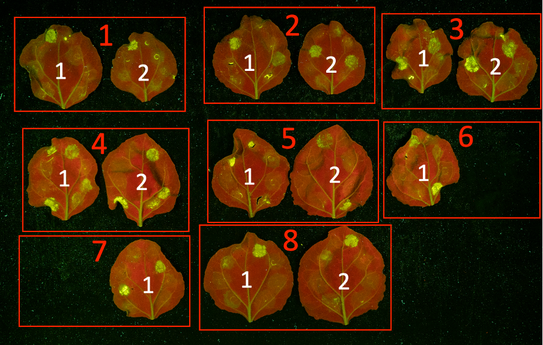
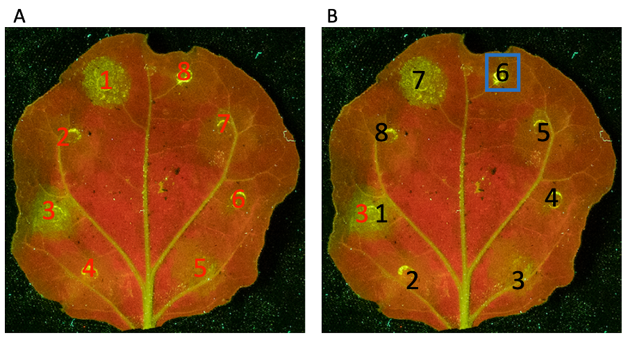

### Installing the cdataml package:

Install into a conda environment from PyPI.

```sh
$ conda activate <my-env>
(my-env) $ pip3 install cdataml
```

Or install it from GitHub.

```sh
$ conda activate <my-env>
(my-env) $ pip3 install git+https://github.com/joshuandwilliams/cdataml
```


### Assumptions about image layout:

This package is built on a number of assumptions about the format of images to be processed.

1. The number of cell death areas per leaf is assumed to be consistent.
2. Images are assumed to be made up of pairs of technical replicates (pairs of leaves from the same plant with the same treatment pattern) .
3. The treatment pattern is assumed to be made in an anticlockwise pattern from the upper left of the central vein, and to be offset by one position with each new technical replicate pair.
4. The number of technical replicates per biological replicate is assumed to be equal to the number of spots per leaf (one technical replicate for each offset value).

<details markdown=1><summary markdown="span">Infiltration format - click to expand</summary>

Each cell death area will be identified though a number of factors.

1. The Img-ID variable references to a specific image filename.
2. The Plant-Per-Img-ID variable references a pair of technical replicates from the same plant.
3. The Leaf-ID variable references a particular leaf from the pair (1 or 2).
4. The Offset variable references the position from which to start counting anti-clockwise to identify the individual cell death area. An Offset of 1 indicates the user should start at the position to the upper left of the central vein, and an Offset of 2 indicates that the user should start from one position anticlockwise of position 1.
5. The Spot-ID variable references how far to count anticlockwise from the Offset. A Spot-ID of 1 means that the cell death area in question is the same as the Offset, and a Spot-ID of 2 means that the user should count one position anticlockwise from the Offset.



In the image above, the red numbered boxes represent the technical replicates (Plant-IDs). Each of the two white numbered leaves (Leaf-IDs) in each replicate have been treated with the same infiltration pattern. Two technical replicates are missing a leaf. This is ok, as long as not both of the technical replicates are missing, since then the correct Offset value cannot be known.



In the above image, the red numbers in A) represent the Offset positions, starting from the top left of the central vein, and counting anticlockwise. These leaves each have 8 cell death areas - a different number can be used, but must be consistent across all leaves. In B) An example is given to show the cell death area assigned to Offset 3, Spot-ID 6. Beginning at the Offset 3 (in red), the user counts anti-clockwise, until position 6, highlighted in a blue box.

</details>
