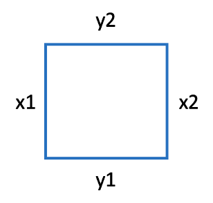
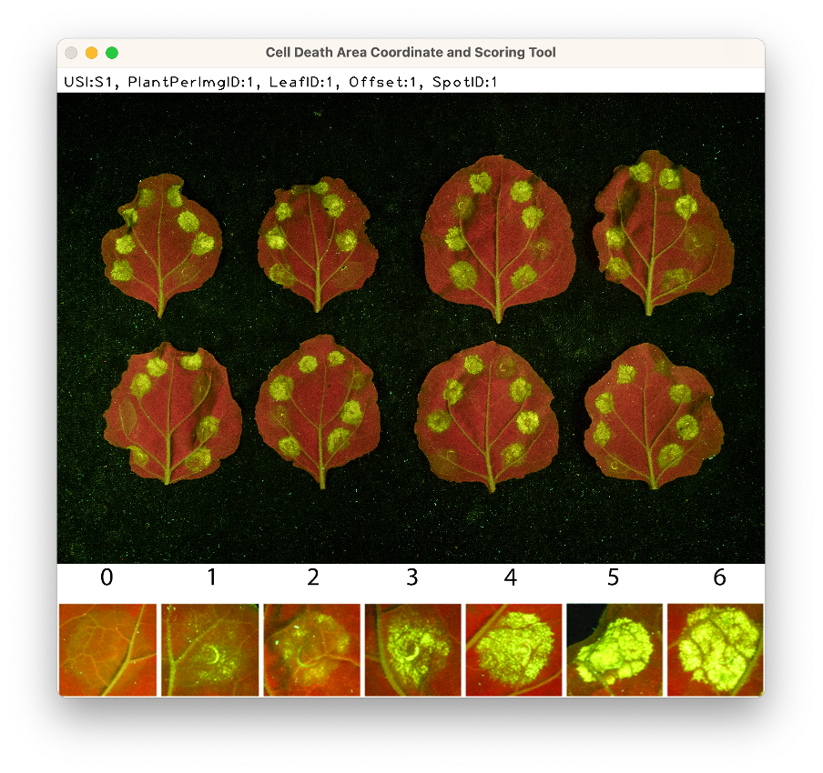

### Introduction:

Now that the blank metadata tables have been created using ```cdataml_generate``` it is time to start filling the missing values. ```cdataml_coordinates``` exists to allow users to record and score coordinate boundaries for individual CDAs in the ```cdata.csv``` metadata file.



The image above shows the four coordinate values that are collected with ```cdataml_coordinates```.

Additionally, if the user does not have existing score data, scoring can be done alongside coordinate collection.

### Running cdataml_coordinates:

The module can be run from the command line.

```sh
(my-env) $ python3 -m cdataml_coordinates -i cdata.csv -o cdata.csv -f images.csv [-s <OPTIONAL>]
```

### Options:

There are four options taken by ```cdataml_generate```:
1. ```-i```: The path for the metadata file to be updated.
2. ```-o```: The path for the updated metadata file. Note that these are the same in the code example given, since ```cdataml_coordinates``` will create a backup of the previous version of the input file with the name ```backup_<inputfilename>```.
3. ```-f```: The path for the file containing the image filepaths.
4. ```-s```: Optional argument that allows the user to input a score after recording coordinates. This defaults to ```False``` but is set to ```True``` when ```-s``` is called.

### Interacting with the OpenCV window:

When you run ```cdataml_generate```, a window will appear in this format:



The image displayed corresponds to Img-ID 1 in ```images.csv```. The metadata in the bar at the top references a particular CDA on that image.

1. Click on the window to bring it to the front. Also make sure you can see the cmd window since it will give directions.
2. Identify the CDA referenced by the metadata bar.
3. Left-click and drag a box around that CDA. If you don't like the selection made, simply repeat the left-click and drag.
4. Press Enter. This saves the coordinates you dragged.
5. If the -s flag was called, then enter a score between 0 and 6. If you you enter a value outside of this range, you will be prompted to try again until you enter a valid value.
6. The window will then update to the information on the next row in ```cdata.csv```. The values in the metadata bar will update, and if the image has changed, that will also update.
7. If you are missing a leaf, or your technical replicate pairs are split over more than one image, it is possible to skip.
    1. If a single leaf is missing, instead of dragging a box, press ```ESC``` once, and then ```m```. This will skip to the next Leaf-ID without changing any Offset values.
    2. If the replicate continues onto another image, instead of dragging a box, press ```ESC``` once, and then ```n```. This will skip to the next Img-ID and will update the Offset values of that image to match those unfilled in the previous image.
8. If at any time you wish to stop scoring, press ```ESC``` twice, and the program will save your progress to the output file location. Then, if you use that output file as your next input file, the program will pick up where you left off. 

### Outputs:

Once all coordinates (and optionally scores) have been recorded, those columns will be filled in the output file.

### Troubleshooting:

- If you think you made an error when recording coordinates or scores, you can exit out of the program by pressing ```ESC``` twice, then either delete the offending coordinates/scores from your data table before continuing, or use the backup file as your input file the next time you run the progam.
- If you are missing both technical replicates of a particular Plant-ID on an image and you know the Offset value of those leaves, you can skip each of those leaves individually using ```ESC``` then ```m```.
