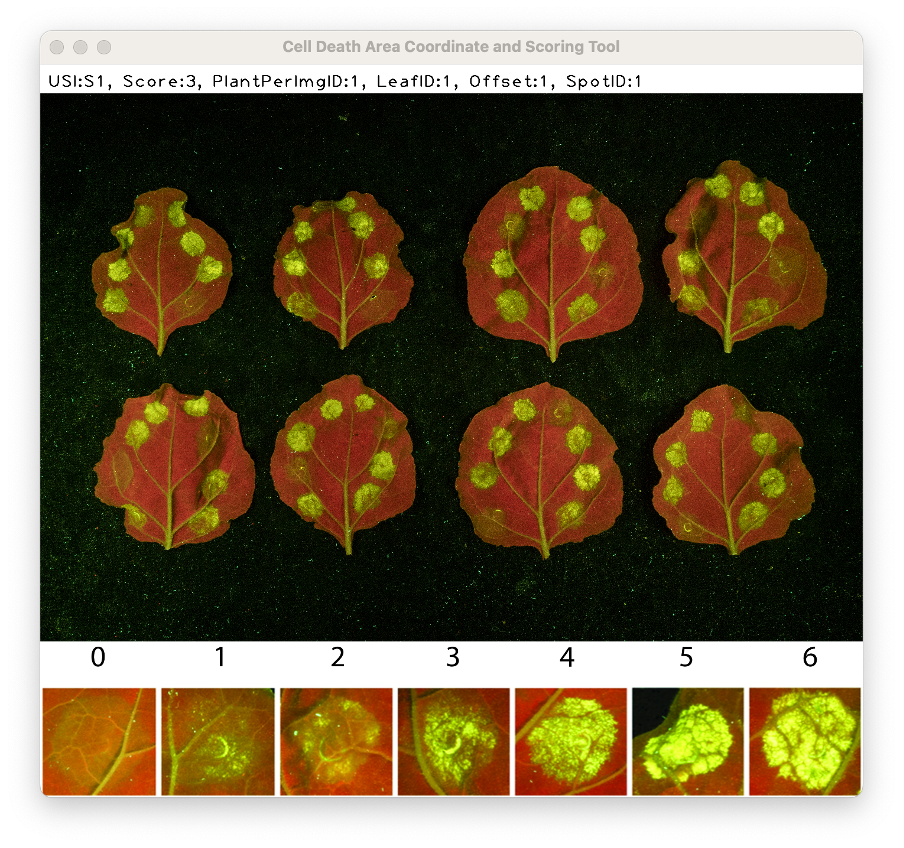

### Introduction:

Now all of your data has been collected and recorded. If there is reasonable evidence for mistakes in scoring (verified with those who undertook the scoring in the first place), you may wish to query (and optionally rescore) some scores. ```cdataml_query``` allows this to be done.

### Running cdatml_query:

The module can be run from the command line.

```sh
(my-env) $ python3 -m cdataml_query -i cdata_scored.csv -o cdata_queried.csv -f images.csv [-s <OPTIONAL>]
```

### Options:

There are four options taken by ```cdataml_query```:
1. ```-i```: The path for the scored metadata file to be updated.
2. ```-o```: The path for the queried metadata file. ```cdataml_query``` will create a backup of the previous version of the input file with the name ```backup_<inputfilename>```.
3. ```-f```: The path for the file containing the image filepaths.
4. ```-s```: Optional argument that allows the user to input a rescore after querying. This defaults to ```False``` but is set to ```True``` when ```-s``` is called.


### Interacting with the OpenCV window:

The image displayed corresponds to Img-ID 1 in ```images.csv```. The metadata in the bar at the top references a particular CDA on that image.



1. Click on the window to bring it to the front. Also make sure you can see the cmd window since it will give directions.
2. Identify the CDA referenced by the metadata bar.
3. If you wish to query the score, press ```q```, else press any other key.
4. If the -s flag was called, then enter a score between 0 and 6. If you you enter a value outside of this range, you will be prompted to try again until you enter a valid value.
5. The window will then update to the information on the next row in ```cdata.csv```. The values in the metadata bar will update, and if the image has changed, that will also update.
6. If at any time you wish to stop scoring, press ```ESC```, and the program will save your progress to the output file location. Then, if you use that output file as your next input file, the program will pick up where you left off. 

### Outputs:

In the output metadata file, two new columns will be added:
1. ```Query```: This will contain a 1 if the value was queried, and a 0 otherwise.
2. ```Rescore```: If the Query value is 1, this will contain a rescore value between 0 and 6

### Troubleshooting:
- If you think you made an error when querying or rescoring, you can exit out of the program by pressing ```ESC```, then either delete the offending query/scores from your data table before continuing, or use the backup file as your input file the next time you run the progam.
