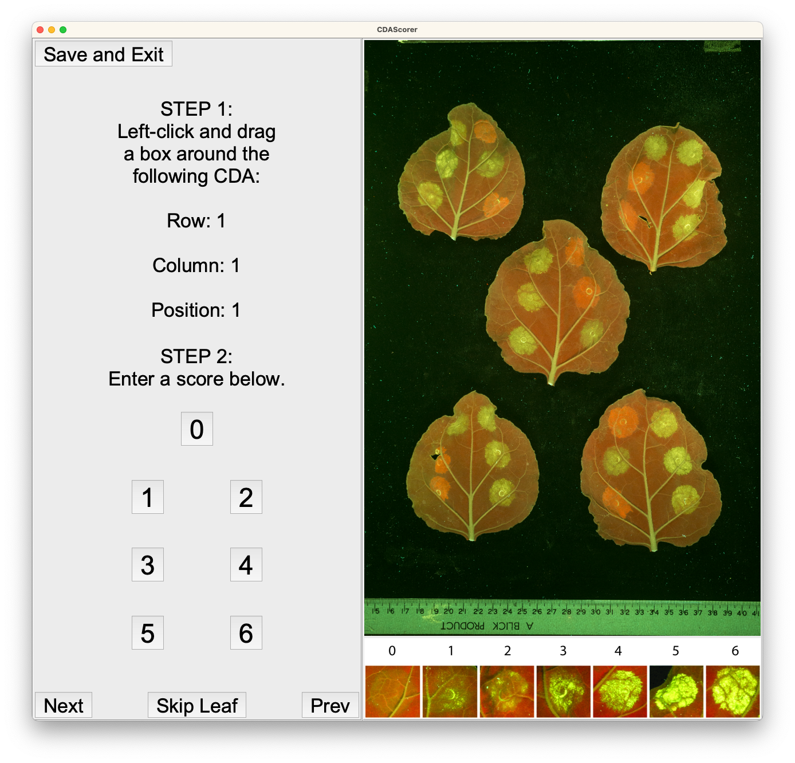

Welcome to the CDAScorer package. This package is designed to support in the creation and recording of cell death area (CDA) data in a standardised format. This tutorial will guide you through installing and using it.

### Installing the CDAScorer package:

Install into a conda environment from PyPI.

```sh
$ conda activate <my-env>
(my-env) $ pip3 install cdascorer
```

Or install it from GitHub.

```sh
$ conda activate <my-env>
(my-env) $ pip3 install git+https://github.com/joshuandwilliams/CDAScorer
```

### Quickstart:

Run the package with your own data, where any TIFF images to be used are in a single folder (source folder).

```sh
(my-env) $ cdascorer -s <SOURCE-FOLDER> -f <DATA-FILE> -n <CDA_PER_LEAF>
```

Or, run the package on an example image included in the package files.

```sh
(my-env) $ cdascorer-test
```

Load the help information:

```sh
(my-env) $ cdascorer -h
```

On Windows these commands change slightly, and there is an assumption that assume that .PY is in your PATHEXT system variable.
```sh
(my-env) $ cdascorer-windows.py -s <SOURCE-FOLDER> -f <DATA-FILE> -n <CDA_PER_LEAF>
(my-env) $ cdascorer-windows-test.py
(my-env) $ cdascorer-windows.py -h
```

### Detailed information:

#### Image format:

1. Each image should contain leaves in a grid pattern.
2. Each leaf should contain cell death areas in positions 1 to n, where 1 is upper left of the central vein, and subsequent positions count anticlockwise from that position.


In the image above, the table shows an example row of data which will be recorded for each CDA.
1. The maxrow, maxcol, row, and col variables are found by dividing the image into a grid. maxrow and maxcol are the total number of rows and columns, and row and col are those of the current CDA.
2. The pos variable refers to cell death areas in positions 1 to n, where 1 is upper left of the central vein, and subsequent positions count anticlockwise from that position (shown in blue numbering).
3. The score variable is recorded in the program.
4. The coordinate variables x1, x2, y1, and y2 are recorded in the program also, and represent the horizontal and vertical positions shown in the blue box on the right.

#### Options:

1. ```-s```: The source folder containing the TIFF images. Defaults to "."
2. ```-f```: The CSV file to contain the recorded data. If it does not exist, it will be created. Defaults to "cdata.csv"
3. ```-n```: The number of CDAs per leaf. Defaults to 8.
4. ```-t```: Defaults to False, but if ```-t True``` supplied, will run the package on an example image. This can be done automatically by running ```cdascorer-test```
5. ```-w```: The size of the window (specifically, the pixel width of the image to be displayed). Defaults to 1000.

#### Recording coordinates and scores:

Upon running the program, the first image will be displayed. The user should input the total number of rows and columns for that image as well as the number of CDAs per leaf into the entry boxes and press the "Submit" button.


The program will then append the scoring key to the bottom of that image, and the row, column, and position of the current CDA to be scored will appear in the left panel.



Using the metadata, identify the corresponding CDA. Left click and drag to draw a bounding box around that CDA. The box can simply be re-drawn if a mistake is made.

Then, enter the score between 0 and 6 for that CDA by either pressing the corresponding key or clicking the corresponding button.

The metadata at the left panel will update to the next CDA to be scored, and the process of recording coordinates and scores can be repeated.

To quit, click the "Save and Exit" button in the top left. Your progress will be saved to the output file location.

If the program is run again on this output file, it will begin where you left off.


#### What if there are missing CDAs or leaves?

Sometimes leaves will be damaged, resulting in regions being unintelligible, or just being removed from the image altogether.

Non-existent CDAs and leaves can be skipped by pressing the "Next" or "Skip Leaf" buttons in the left pane of the scoring window.

This is particularly useful when leaves are missing due to the image layout.


#### What if I made a mistake and want to go back?

If you wish to redo a previous score, press the "Prev" button in the left pane of the scoring window, which will return to the last data entry, removing it.

When you input new coordinate and score values, they will overwrite the previously existing data for that CDA.

