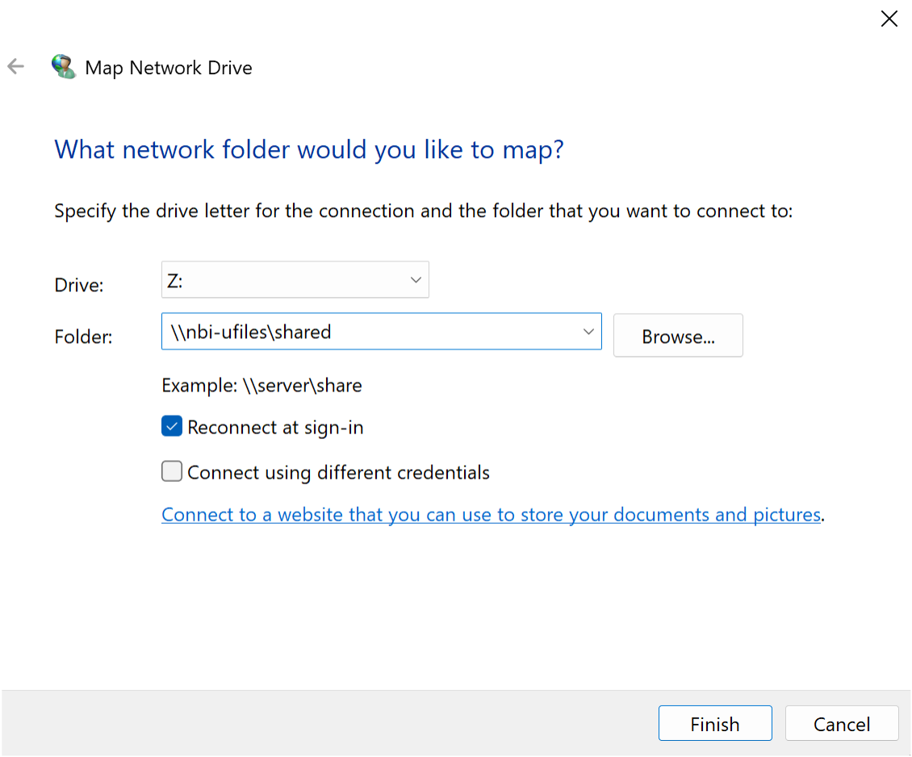
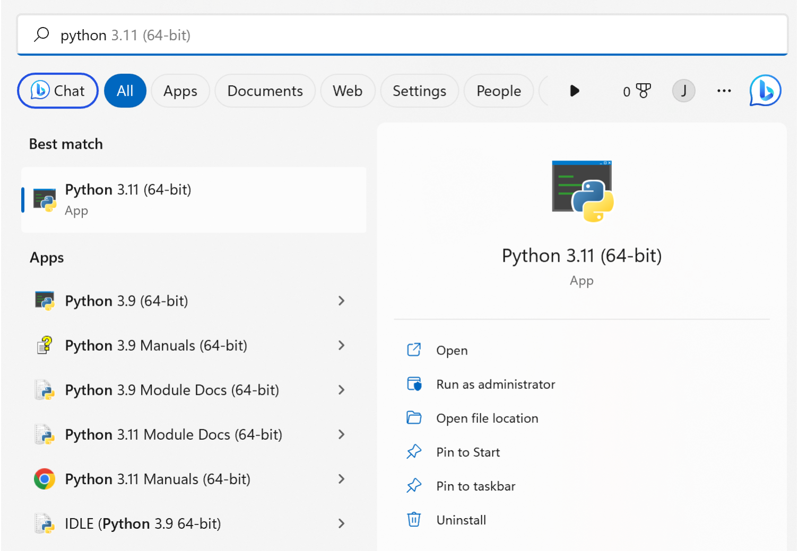

There is no separate Windows version of CDAScorer — the install is the same as on Mac. Earlier versions of this guide asked you to edit your `PATH` and `PATHEXT` variables by hand; that is no longer necessary. As long as you install and run everything from the **Anaconda Prompt**, conda puts the `cdascorer` command on your path automatically.

## Step 1: Make sure you are connected to Eduroam

## Step 2: Map the Banfield shared drive in your File Explorer

Open File Explorer.

In the lower half of the left pane, click on "This PC".

Then, in the top bar, click on "Map Network Drive". This is sometimes hidden in a drop down menu.

A window will pop up. In the "Folder: " box, type "\\\\nbi-ufiles\\shared" and press "Finish".

*This is the window you should see during this step*


## Step 3: Make sure Anaconda is installed

Check if Anaconda is installed by typing "Anaconda" in your Windows search bar. If you see an application with a green logo called **Anaconda Prompt** (or Anaconda Navigator), it is installed.

If Anaconda is not installed, head to [the Anaconda download page](https://www.anaconda.com/download) and work through the installer (warning - this can take a while so you'll need to be patient). Anaconda comes with its own copy of Python, so you do not need to install Python separately.

*You should be able to find Python bundled with Anaconda*


## Step 4: Open the Anaconda Prompt

From the Windows search bar, open the **Anaconda Prompt**. Run every command in the steps below from this window — it is already set up to find conda and, after you activate an environment, the `cdascorer` command.

You can confirm conda is working by typing:

```sh
conda env list
```

You should get a list of filepaths headed by "conda environments:".

## Step 5: Navigate to where you want to store your scoring data outputs

Use the `cd` (change directory) command to navigate to an empty folder where you'd like to store your output files. For example, if you have a folder called CDAScorer_Data in your Documents folder:

```sh
cd C:\Users\YOUR_USERNAME\Documents\CDAScorer_Data\
```

where YOUR_USERNAME is your NBI username e.g. jowillia.

## Step 6: Create and activate a conda environment

A conda environment is effectively a sealed box on your computer, so that anything installed inside it is contained and doesn't make permanent changes to the rest of your system.

Create an environment for scoring:

```sh
conda create --name CDAScorer
```

Then activate it (stepping inside the sealed box):

```sh
conda activate CDAScorer
```

You should now see `(CDAScorer)` at the start of your command line. Every time you open the Anaconda Prompt, if your environment shows `(base)` you should activate the CDAScorer environment again.

## Step 7: Install the CDAScorer package

```sh
pip install cdascorer
```

This will install the package along with any other Python packages it depends on. To update to the latest version later, run `pip install --upgrade cdascorer`.

## Step 8: Run the CDAScorer package with test data

Verify everything works by running the built-in example:

```sh
cdascorer --test
```

A user interface should appear. You can press the "Save and Exit" button in the top left to quit.

If you type `dir` afterwards you should see a new file called `cdata.csv` (and, if you had run it before, a timestamped `backup_..._cdata.csv` copy).

This is great! It means the package is running successfully on your laptop. [Follow this link to start scoring real data!](https://joshuandwilliams.github.io/CDAScorer/scoring_meeting/)
