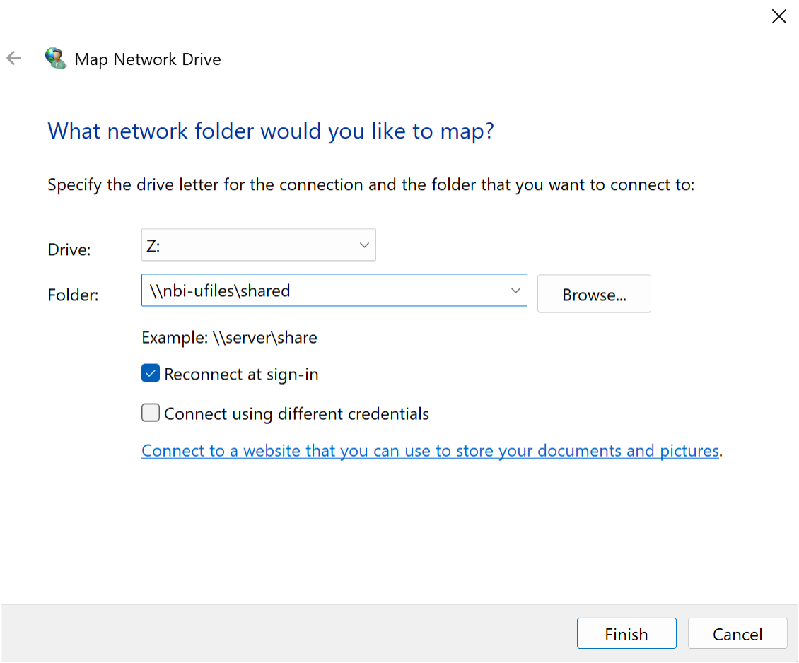
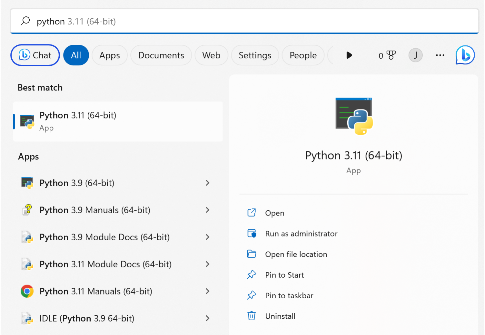
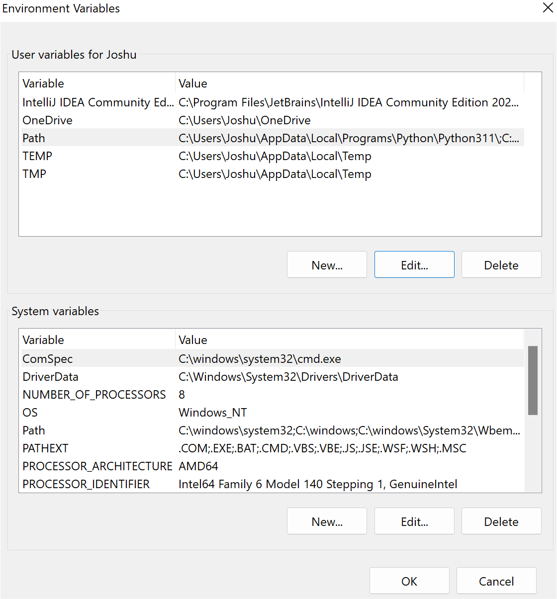
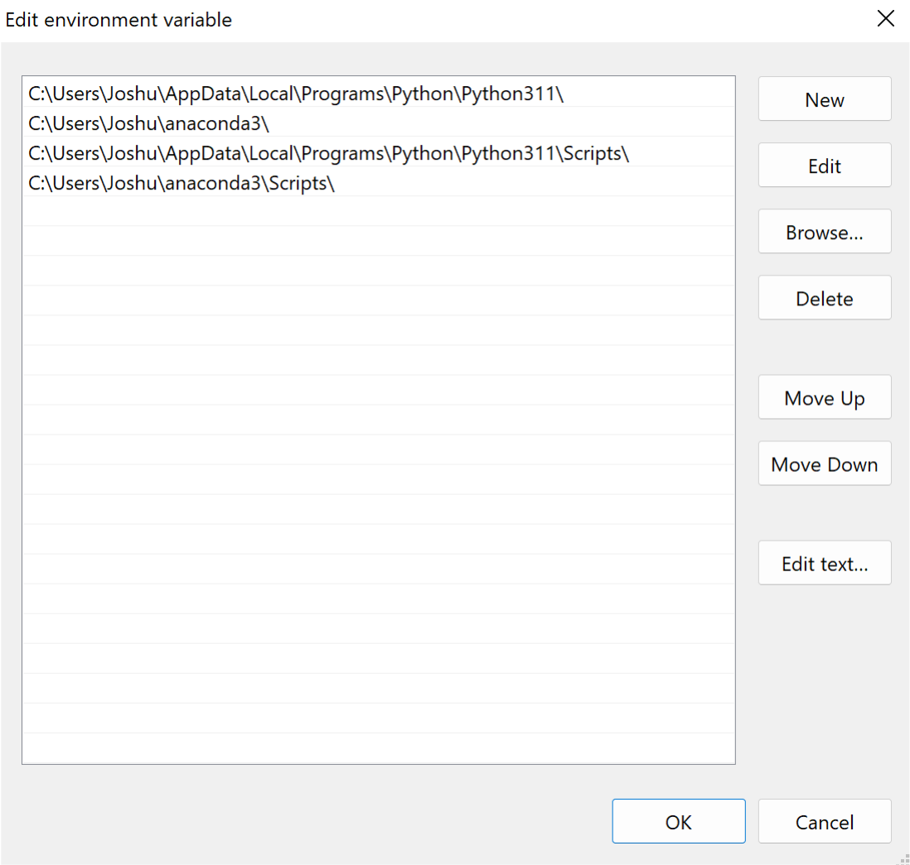

## Step 1: Make sure you are connected to Eduroam

## Step 2: Map the Banfield shared drive in your File Explorer

Open File Explorer.

In the lower half of the left pane, click on "This PC".

Then, in the top bar, click on "Map Network Drive". This is sometimes hidden in a drop down menu.

A window will pop up. In the "Folder: " box, type "\\\\nbi-ufiles\\shared" and press "Finish".

*This is the window you should see during this step*


## Step 3: Make sure Python is installed.

Check if Python is installed on your computer by typing "Python" in your Windows search bar. If you see an application e.g. Python 3.11 (64-bit), it is installed.

*This is what you should see if Python is installed*


Your Python will need to be up to date for my tool to run. Make sure this number is 3.9 or higher.

If Python is not installed or is an old version, you will need to download a new version of Python. Head to [the Python download page](https://python.org/downloads/) and click on the yellow button "Download Python 3.11.2". Then click on your download and work through the installer.

Now we need to check if your computer can see this newly installed Python. Windows uses a variable called PATH which tells it where to look when running programs, and it doesn't always automatically update when a new program is installed.

Open the command line by typing "cmd" into the windows search bar and clicking on the application that comes up.

In the cmd window, type ```py -V``` and press enter.
- If Python 3.11.2 (replace with your version number) appears, your computer can see Python.
- If it gives an error about it not being a recognized command, we will need to update the PATH variable after checking the same for Anaconda.


## Step 4: Make sure Anaconda is installed.

Check if Anaconda is installed on your computer by typing "Anaconda" in your Windows search bar. Like with Python, if you see an application with a green logo called Anaconda Navigator, it is installed.

If Anaconda is not installed, you will need to download it. Head to [the Anaconda download page](https://www.anaconda.com/products/distribution) and click on the green button "Download". Then click on your download and work through the installer (warning - this can take a while so you'll need to be patient).

Now we need to check if your computer can see Anaconda, like we did for Python.

In the cmd window, type ```conda env list``` and press enter.
- If you get a list of filepaths headed by "conda environments:", your computer can see Anaconda.
- If it gives an error about conda not being recognized as a command, we will update the PATH variable.


## Step 5 (Optional - see steps above): Updating the PATH variable.

Unlike Mac, Windows doesn't automatically know where to find your Python and Anaconda installations, which is why it threw up some errors when we tried to run Python and Anaconda commands. Windows looks through all the folders in a variable called PATH when looking for executable commands. You can look at your path by typing "path" into the cmd window. You'll see a list of paths separated by semi-colons.

To show Windows where to look, we will add the installation paths to the PATH variable.

First, you need to find out where Python and/or Anaconda are installed. You only need to do this for those that said "X is not recognized as a command". You can find the installation path of a program as follows:

1. Type Python or Anaconda in the Windows search bar.

2. In the right pane, click "Open file location". This will bring up a file explorer window with the item highlighted.

3. Right click the highlighted item, and again click "Open file location". This will take you to the install location.

4. The top bar contains the filepath which we will need to add to the PATH variable. For Python, it should look something like "C:\\Users\\YOUR_USERNAME\\Appdata\\Local\\Programs\\Python\\Python311\\", and for Anaconda, "C:\\Users\\YOUR_USERNAME\\anaconda3\\". Copy this text into a note document, you will need it shortly.

You will now have a notes document with your installation path of Python and/or Anaconda. We will add two more paths to this document, by copying the existing paths and adding "Scripts\\" to the end.

*Example of what your notes document might look like*


Now we want to add these paths to your PATH variable. To do this, complete the following steps:

1. Open File Explorer.

2. In the left pane, right click "This PC"" and select "Properties".

3. Select "Advanced system settings".

4. Select "Environment Variables".

5. This will bring up the Environment Variables window which contains two panels. At the top is the User Variables panel, and at the bottom is the System Variables panel.

*Image of the Environment Variables panel*



6. In the User Variables panel, click on "Path", and press "Edit...".

7. Click "New", and an empty textbox will appear asking you to input some text. Copy the first path from your notes document in here.

8. Repeat this, pressing "New" again, and this time entering the second path from your note document. Then repeat this with any remaining paths and press "Ok".

*Image showing updated path variable*



9. You will have returned to the Environment Variables window. Whilst we are here, we have another important step to do, which is updating the PATH_EXT System Variable. This variable tells Windows which file types are executable, and it doesn't automatically include Python files (.py).

10. In the System Variables panel, click on "Pathext", and press "Edit...".

11. In the "Variable value:" box, add ";.PY"

*Image showing updated pathext variable*


12. In order to make sure these variables properly updated, you need to restart your computer.

Once you've restarted your PC, reopen the cmd window. Typing "py -V" or "conda env list" should now work.

## Step 6: Navigate to where you want to store your scoring data outputs.

Use the cd (change directory) command in the cmd window to navigate to an empty folder location you'd like to store your files. For example, if you have a folder called CDAScorer_Data in your Documents folder, you could navigate there by typing "cd \\\\Users\\\\YOUR_USERNAME\\\\Documents\\\\CDAScorer_Data\\\\" where YOUR_USERNAME is your NBI username e.g. jowillia.

## Step 7: Creating a conda environment

We installed Anaconda so we can run packages inside what is effectively a sealed box on your computer. So that if the packages make any changes to local or global settings, they are contained and don't make permanent changes to your computer. This box is called a conda environment.

Type "conda init", then when it finishes running, restart the cmd window.

To create a conda environment for scoring, type ```conda create --name CDAScorer```. This creates an environment called CDAScorer.

Then activate this environment (stepping inside the sealed box), and this can be done by typing ```conda activate CDAScorer```. You should now see that at the start of your line it says (CDAScorer). Every time you open the cmd window, if your environment is (base) you should activate a conda environment.

## Step 8: Downloading the CDAScorer package

To download my CDAScorer package, we use pip, which comes with Python. Do this using the code ```pip install cdascorer```.

This will install my package as well as any other Python packages it depends on to run.

## Step 9: Running the CDAScorer package with test data

Now you are all set to run the program. Run a the test program to verify that it works with the following command ```cdascorer-windows-test.py```

When you enter that command, a user interface should appear. You can press the exit button in the top left to quit.

If you enter "ls" into the cmd window (if this gives an error try "dir"), you should see two new files, one called "test_cdata.csv" and one called "backup_X_test_data.csv", where X is replaced with the day, month, year, hour, minute.

This is great! It means the package is running successfully on your laptop.
